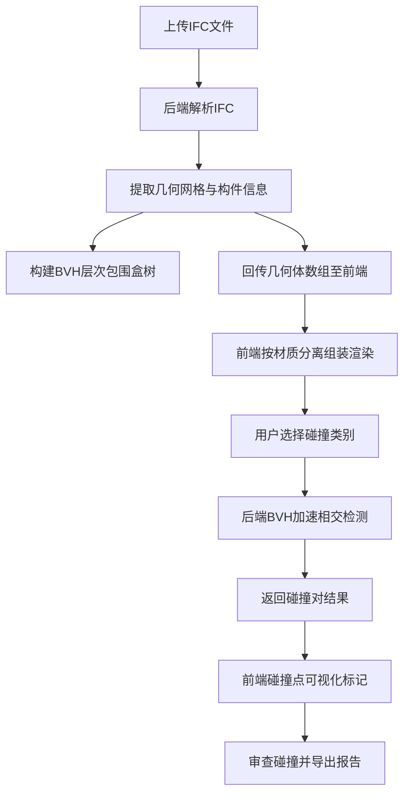

## 1. 产品概述

建筑工程三维轻量化审查平台（BIM Clash Detection Platform），面向建筑工程师与BIM协调员，提供IFC模型的在线加载、轻量化渲染、材质分离展示以及土建与机电管线之间的自动碰撞检测能力。通过后端BVH树加速相交计算，解决传统BIM审查工具依赖重型桌面软件、协作困难的痛点，实现网页端即开即用的轻量化审查体验。

## 2. 核心功能

### 2.1 用户角色

| 角色 | 注册方式 | 核心权限 |
|------|----------|----------|
| 工程师 | 邮箱注册 | 上传模型、查看三维视口、执行碰撞检测、导出报告 |
| 协调员 | 邮箱注册 | 以上权限 + 管理项目、分配碰撞问题、审核修复状态 |

### 2.2 功能模块

1. **项目首页**：项目列表、最近审查记录、快速操作入口
2. **模型审查页**：三维WebGL视口、模型树面板、材质图层面板、碰撞检测结果面板
3. **碰撞报告页**：碰撞对列表、筛选与统计、导出功能

### 2.3 页面详情

| 页面名称 | 模块名称 | 功能描述 |
|----------|----------|----------|
| 项目首页 | 项目卡片列表 | 展示所有项目，支持新建、搜索、删除 |
| 项目首页 | 快速操作 | 上传IFC模型、最近审查记录快捷入口 |
| 模型审查页 | 三维WebGL视口 | 加载渲染IFC建筑模型，支持旋转/平移/缩放，按材质分离渲染土建墙体与机电管网 |
| 模型审查页 | 模型树面板 | 树形展示IFC空间结构（项目→站点→建筑→楼层→构件），支持显隐切换 |
| 模型审查页 | 材质图层面板 | 按材质类别（混凝土/钢/暖通/给排水/电气）切换图层可见性与颜色 |
| 模型审查页 | 碰撞检测面板 | 选择碰撞类别（土建vs机电、机电vs机电）、执行检测、展示碰撞点列表与可视化标记 |
| 模型审查页 | 属性面板 | 点击构件查看IFC属性集（尺寸、材料、分类编码等） |
| 碰撞报告页 | 碰撞对列表 | 表格展示所有碰撞对，包含位置、类型、严重程度 |
| 碰撞报告页 | 统计图表 | 按楼层/类别/严重程度的碰撞分布统计 |
| 碰撞报告页 | 导出功能 | 导出碰撞报告为CSV/JSON格式 |

## 3. 核心流程

用户上传IFC文件 → 后端解析IFC提取几何体与构件信息 → 后端构建BVH树 → 前端加载几何体数组并按材质组装渲染 → 用户选择碰撞类别执行检测 → 后端BVH加速相交计算 → 前端可视化碰撞点 → 用户审查并导出报告

## 4. 用户界面设计

### 4.1 设计风格

- **主色调**：深蓝灰（#1a1f2e）背景 + 科技蓝（#3b82f6）强调色，营造专业工程工具感
- **辅助色**：暖橙（#f59e0b）用于碰撞警告，翠绿（#10b981）用于状态通过
- **按钮风格**：圆角4px，扁平化带微妙阴影，hover态有发光边框
- **字体**：标题用 JetBrains Mono（等宽工程感），正文用 Noto Sans SC
- **布局风格**：左侧面板+中央视口+右侧属性的经典CAD布局
- **图标风格**：线性图标，2px描边，lucide-react图标库

### 4.2 页面设计概览

| 页面名称 | 模块名称 | UI元素 |
|----------|----------|--------|
| 项目首页 | 项目卡片列表 | 深色卡片网格，hover抬升阴影，缩略图预览 |
| 项目首页 | 快速操作 | 圆形图标按钮，拖拽上传区域 |
| 模型审查页 | 三维视口 | 占据中央80%区域的WebGL画布，底部工具栏（视角切换、截图、测量） |
| 模型审查页 | 模型树面板 | 左侧可折叠面板，树形节点带复选框控制显隐 |
| 模型审查页 | 材质图层面板 | 左侧折叠面板，色块+开关的图层列表 |
| 模型审查页 | 碰撞检测面板 | 右侧面板，碰撞对卡片带定位按钮 |
| 模型审查页 | 属性面板 | 右侧折叠面板，键值对列表 |
| 碰撞报告页 | 碰撞对列表 | 深色表格，行点击定位到三维视口 |
| 碰撞报告页 | 统计图表 | 柱状图/饼图，echarts风格 |

### 4.3 响应式设计

- 桌面优先设计，最低支持1280px宽度
- 面板可折叠/展开适配不同屏幕
- 三维视口自适应容器尺寸

### 4.4 3D场景指导

- **环境**：深灰色渐变天空盒，模拟专业BIM审查环境
- **光照**：环境光（0.4强度）+ 方向光（0.8强度，45度角）+ 半球光补充
- **相机**：透视相机，初始等轴测视角（ISO），支持轨道控制旋转/平移/缩放
- **构图**：模型居中，自动适配视口
- **交互**：点击选中构件高亮（黄色线框），双击聚焦；碰撞点用红色球体标记；hover构件半透明高亮
- **后期处理**：可选描边效果（OutlinePass）用于选中构件
- **性能预算**：目标100万三角面30fps，采用LOD与实例化渲染优化

## 5. 碰撞检测技术说明

### 5.1 BVH树构建

后端从IFC提取的几何体网格数据，按构件粒度构建BVH树：
- 叶节点：单个构件的AABB包围盒
- 中间节点：子节点AABB的合并包围盒
- 树深度：log₂(N)，N为构件数量
- 构建算法：SAH（Surface Area Heuristic）中点分割

### 5.2 相交检测流程

1. 遍历两棵BVH树（如土建树 vs 机电树）
2. 顶层AABB不相交则剪枝跳过
3. AABB相交则递归检查子节点
4. 叶节点相交则进行精确三角面片相交测试
5. 收集所有碰撞对及碰撞点坐标

### 5.3 C++扩展

使用node-addon-api编写C++扩展，核心功能：
- IFC几何体解析（调用web-ifc的WASM模块）
- BVH树构建与序列化
- 高性能三角面片相交测试
- 碰撞结果JSON序列化返回Node.js层
