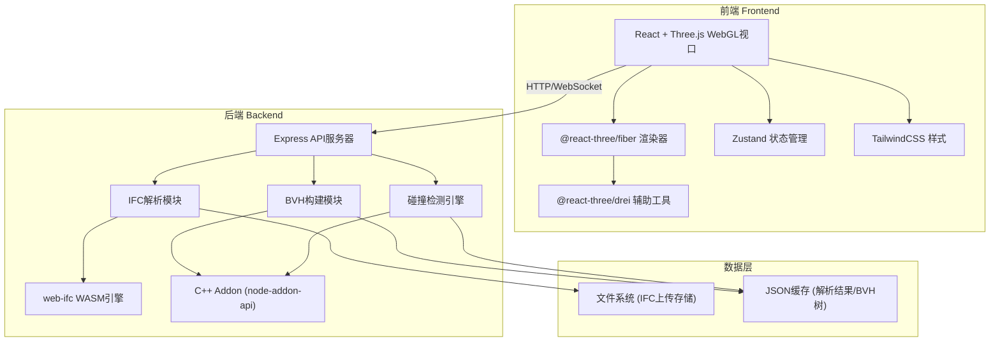
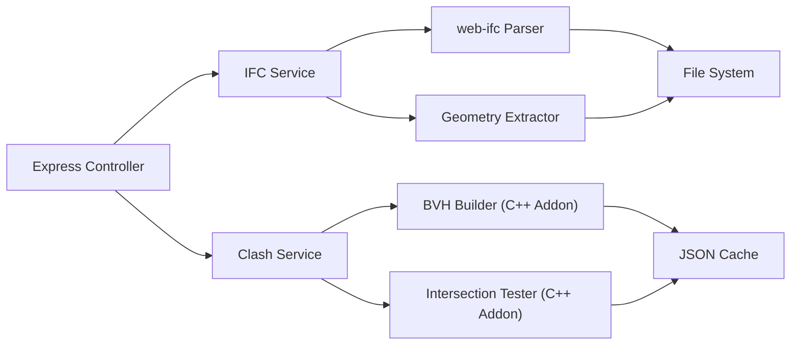
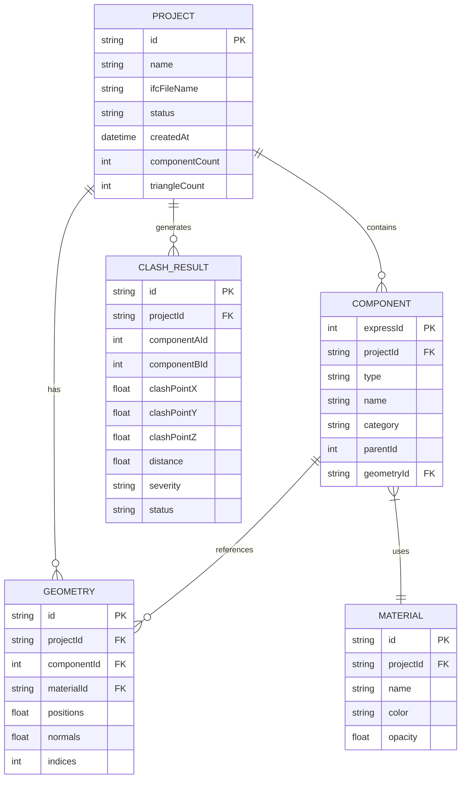

## 1. 架构设计



## 2. 技术说明

- **前端**：React@18 + Three.js + @react-three/fiber + @react-three/drei + @react-three/postprocessing + TailwindCSS@3 + Zustand + Vite
- **初始化工具**：vite-init (react-express-ts模板)
- **后端**：Express@4 + TypeScript + node-addon-api (C++扩展)
- **IFC解析**：web-ifc (WASM) 用于前端预览 + 后端C++层调用
- **BVH**：自研C++ BVH构建与遍历，通过node-addon-api暴露给Node.js
- **数据库**：无数据库，使用文件系统+JSON缓存存储解析结果

## 3. 路由定义

| 路由 | 用途 |
|------|------|
| / | 项目首页，展示项目列表 |
| /review/:projectId | 模型审查页，三维视口+碰撞检测 |
| /report/:projectId | 碰撞报告页，碰撞结果与导出 |

## 4. API定义

### 4.1 TypeScript类型定义

```typescript
interface IFCProject {
  id: string;
  name: string;
  createdAt: string;
  ifcFileName: string;
  status: "uploading" | "parsing" | "ready" | "error";
  stats: {
    componentCount: number;
    triangleCount: number;
    materialCount: number;
  };
}

interface IFCComponent {
  expressId: number;
  type: string;
  name: string;
  material: string;
  category: "structural" | "hvac" | "plumbing" | "electrical" | "other";
  geometryId: string;
  properties: Record<string, string | number>;
  children: IFCComponent[];
}

interface GeometryData {
  id: string;
  positions: Float32Array;
  normals: Float32Array;
  indices: Uint32Array;
  materialId: string;
  componentId: number;
}

interface BVHNode {
  min: [number, number, number];
  max: [number, number, number];
  leftChild?: number;
  rightChild?: number;
  componentId?: number;
  geometryId?: string;
}

interface ClashPair {
  id: string;
  componentA: { expressId: number; name: string; type: string };
  componentB: { expressId: number; name: string; type: string };
  clashPoint: [number, number, number];
  distance: number;
  severity: "hard" | "soft" | "duplicate";
  status: "new" | "acknowledged" | "resolved";
}

interface ClashRequest {
  projectId: string;
  categoryA: string[];
  categoryB: string[];
  tolerance: number;
}

interface ClashResponse {
  jobId: string;
  status: "running" | "completed" | "failed";
  results?: ClashPair[];
  progress?: number;
}
```

### 4.2 API端点

| 方法 | 路径 | 请求体 | 响应 | 说明 |
|------|------|--------|------|------|
| POST | /api/projects | FormData (ifcFile) | IFCProject | 上传IFC文件并创建项目 |
| GET | /api/projects | - | IFCProject[] | 获取项目列表 |
| GET | /api/projects/:id | - | IFCProject | 获取项目详情 |
| DELETE | /api/projects/:id | - | { success: boolean } | 删除项目 |
| GET | /api/projects/:id/tree | - | IFCComponent | 获取模型树结构 |
| GET | /api/projects/:id/geometry | - | GeometryData[] | 获取几何体数据（分块） |
| GET | /api/projects/:id/materials | - | { id, name, color }[] | 获取材质列表 |
| POST | /api/projects/:id/clash | ClashRequest | ClashResponse | 执行碰撞检测 |
| GET | /api/projects/:id/clash/:jobId | - | ClashResponse | 查询碰撞检测进度/结果 |
| GET | /api/projects/:id/clash/:jobId/report | - | ClashPair[] | 获取碰撞报告数据 |
| GET | /api/projects/:id/components/:expressId | - | IFCComponent | 获取构件属性 |
```

## 5. 服务器架构图



## 6. 数据模型

### 6.1 数据模型定义



### 6.2 C++扩展架构

```
src/
  cpp/
    bvh_node.h          # BVH节点定义
    bvh_builder.h/cpp   # SAH BVH构建算法
    bvh_traverse.h/cpp  # BVH遍历与AABB相交测试
    triangle_test.h/cpp  # 精确三角面片相交测试
    addon.cpp           # node-addon-api入口，暴露BVH构建与碰撞检测函数
```

C++ Addon导出函数：
- `buildBVH(components: Array<{id, positions, indices}>)` → 序列化的BVH树JSON
- `queryClashes(bvhA, bvhB, tolerance)` → 碰撞对数组
- `rayIntersect(bvh, origin, direction)` → 射线检测结果（前端拾取用）
